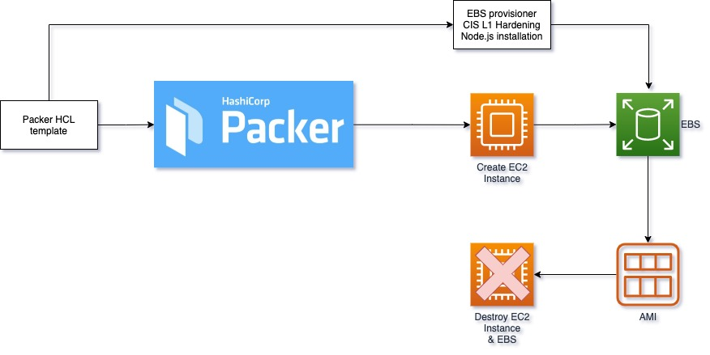

## Objective
Automated creation an AWS AMI running Ubuntu with **CIS Level 1** OS hardening for additional security.
This repository uses Hashicorp Packer for building the AMI as per following diagram:


## Prerequisites
| Requirement | Description |
| ----------- | ----------- |
| Packer | [Installation Instructions](https://learn.hashicorp.com/tutorials/packer/get-started-install-cli) |
| Ubuntu Advantage Account | [Create Account](https://ubuntu.com/advantage) |

## Installation

1. create variables.pkrvars.hcl containing values for input variables in variable.pkr.hcl
2. Build using packer
```
packer build -var-file="variables.pkrvars.hcl" .
```
